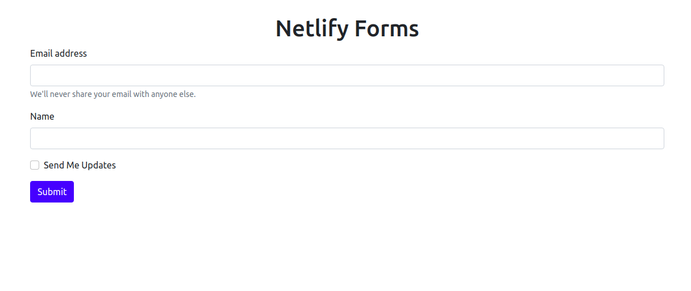
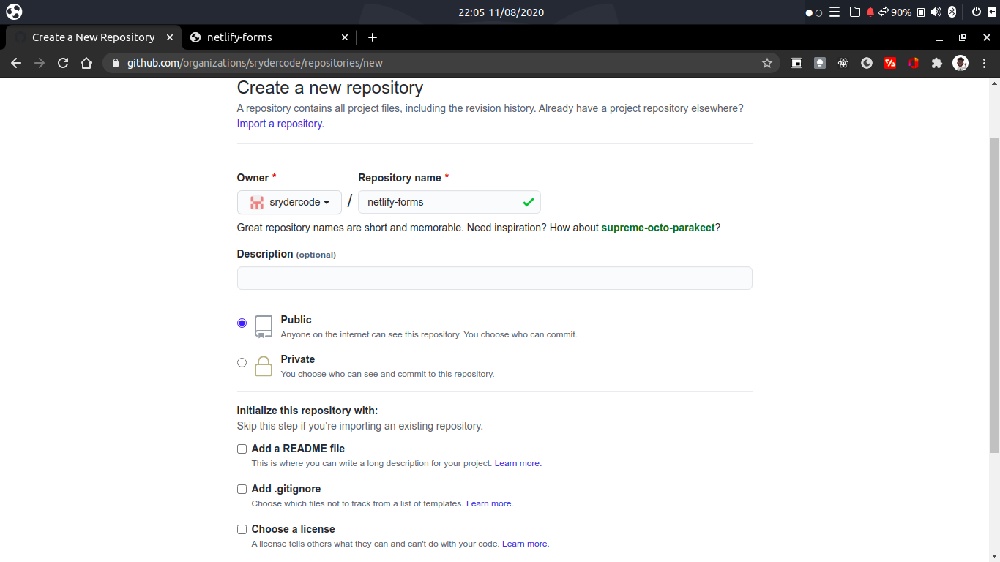
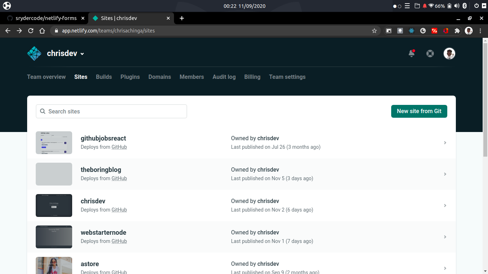
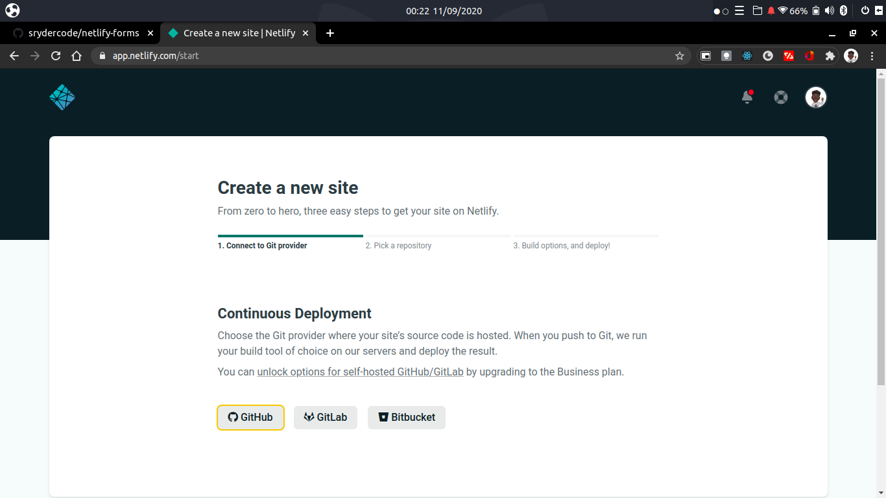
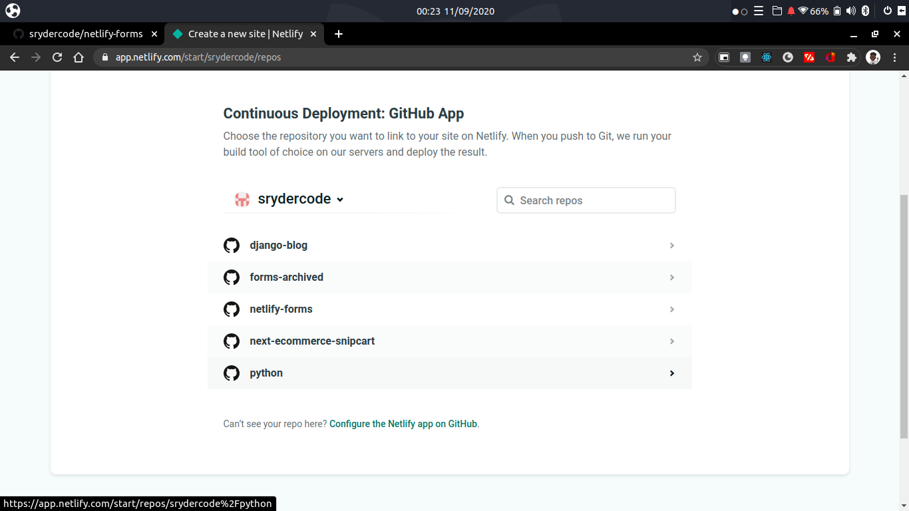
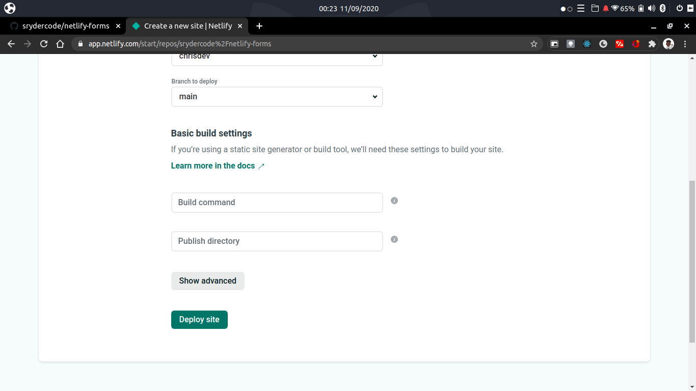
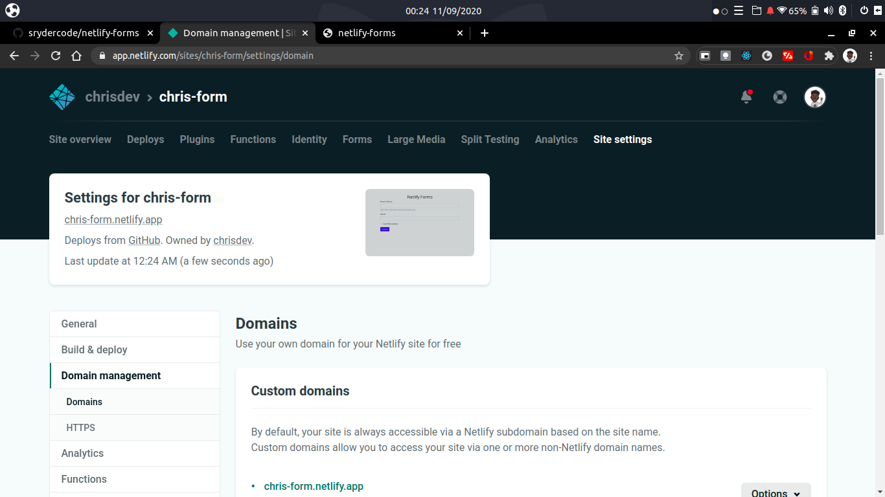
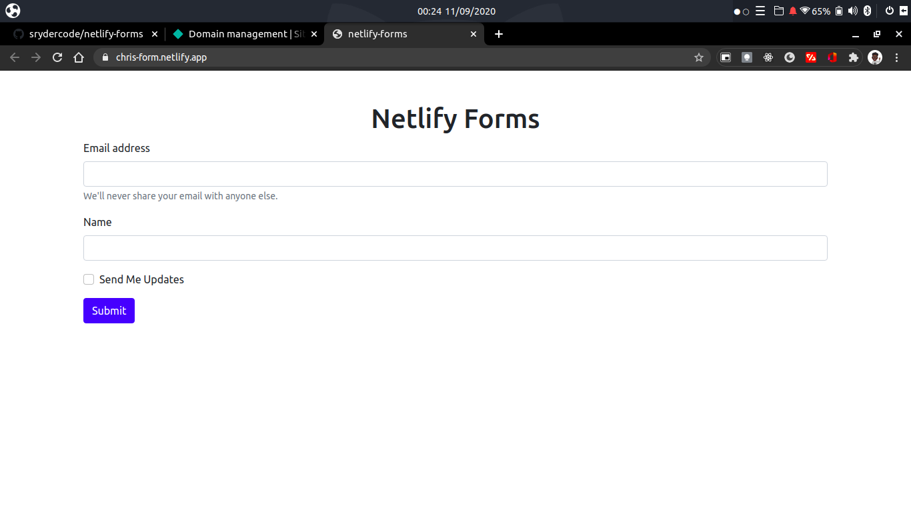

# Form Handling With Netlify Forms

>No backend Needed!


## What is Netlfy?

It is a cloud computing platform that offers hosting and serverless backend services for web applications and static websites.

I have used netlify in almost all of my projects and it never dissapoints.

It is free to use, [https://www.netlify.com](https://www.netlify.com/)

## Handling Forms.

To use netlify forms, your static site must be hosted on Netlify. I'll take you through the process step by step and finaly start using functional forms in your static site.

## STEPS: Netlify Forms

1. #### Create Your Form.
   
   This just a simple HTML form. To get started. Create a new working directory/folder and give it a name, "netlify-forms".

   Open the folder using a text editor of your choice, I prefer using Visual Studio Code.
   
   Create a new html file, *index.html* and create a simple form in it, or paste the code below, in between the `<body>` tags:

   ```html
         <section class="container mt-5">
          <h1 class="text-center">Netlify Forms</h1>
        <form>
            <div class="mb-3">
              <label for="email" class="form-label">Email address</label>
              <input type="email" class="form-control" id="email" aria-describedby="emailHelp">
              <div id="emailHelp" class="form-text">We'll never share your email with anyone else.</div>
            </div>
            <div class="mb-3">
              <label for="name" class="form-label">Name</label>
              <input type="text" class="form-control" id="name">
            </div>
            <div class="mb-3 form-check">
              <input type="checkbox" class="form-check-input" id="checked">
              <label class="form-check-label" for="checked">Send Me Updates</label>
            </div>
            <button type="submit" class="btn btn-primary">Submit</button>
          </form>
      </section>
   ```

   The code above renders a normal form requiring input (email, name) from a user.

   

2. #### Adding to GitHub
   For us to be able to get our forms functional, it should be hosted on Netlify. Netlify hosts sites directly from GitHub Repos, and I will leverage that:

   - Go to: https://github.com/new
   - Create a new repo, give it a name of your choice.
   
   - Open your project folder from the terminal/use inbuilt terminal on vscode, then initialize git
   ```shell
   git init
   ```

   After that, commit your code:
   ```shell
   git add .
   git commit -m "initialized form"
   ```

   To connect your remote repo to github, copy the commands under the `..or push an existing repository from the command line`

   

   Once you have uploaded the code to github, you should be set to deploy it on Neltify.

3. #### Deploy On Netlify
   Head over app.netlify.com and add new site using GitHub, be sure to select the current repo that we working on:

   The following is a pictorial step by step using screenshots from my account:

   >add site
   

   >select github from continous deployment
   

   >choose the repo
   

   >deploy the site
   

   >successfully deployed
   

   >web preview
   